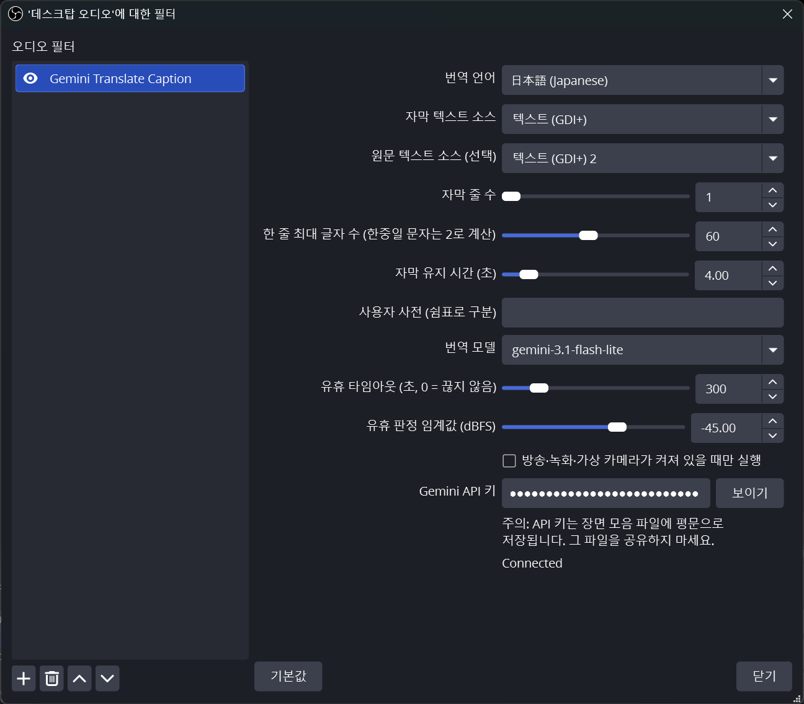

# Gemini Translate Caption for OBS

[English](README.md) | **한국어**

[](https://github.com/plan12be/obs-live-translate-caption/releases)
[](https://github.com/plan12be/obs-live-translate-caption/actions/workflows/release.yaml)
[](LICENSE)


마이크 음성을 Google **Gemini**로 실시간 **번역 자막**으로 바꿔 주는 OBS Studio 네이티브
플러그인입니다(**Windows · macOS · Linux**). `gemini-3.5-transcribe-live`로 음성을 인식하고,
문장 단위로 Flash-Lite 모델(기본 `gemini-3.1-flash-lite`)이 번역해, 직접 꾸민 OBS 텍스트 소스에
써 넣습니다. 방송과 녹화용 자막 오버레이입니다.

이 저장소는 [weisunglee/obs-live-translate](https://github.com/weisunglee/obs-live-translate)
(음성→음성 번역 플러그인)의 포크로 시작해 지금은 자막 전용 독립 프로젝트가 되었습니다. 음성 출력
기능은 제거했습니다([`docs/specs/003-remove-speech-mode.md`](docs/specs/003-remove-speech-mode.md)
참고). 원 프로젝트의 히스토리와 GPLv2 라이선스는 그대로 유지합니다.

> 이 플러그인은 AI(Claude)의 도움을 많이 받아 만들었습니다. OBS Project나 Google과 무관한
> 독립 프로젝트입니다.

## Gemini API 키 받기

플러그인에는 Google **Gemini API 키**가 필요합니다.

1. Google 계정으로 **Google AI Studio** <https://aistudio.google.com/apikey>에 로그인합니다.
2. 처음 사용하는 경우 서비스 약관에 동의하면 AI Studio가 기본 Google Cloud 프로젝트와 키를 자동으로
   만들어 줍니다. 그렇지 않으면 **Create API key**를 누릅니다.
3. 키를 복사해 *Gemini Translate Caption* 필터의 **Gemini API 키** 필드에 붙여 넣습니다.

참고:

- 키는 장면 모음(scene collection) 파일에 **평문으로** 저장됩니다. 그 파일을 공유하지 마세요.
- 사용량은 `gemini-3.5-transcribe-live`와 선택한 번역 모델(기본 `gemini-3.1-flash-lite`)의 Google
  요금에 따라 과금됩니다. 현재 할당량과 가격은 AI Studio에서 확인하세요
  ([가격](https://ai.google.dev/gemini-api/docs/pricing)).

## 현재 상태

**Windows, macOS, Linux**용으로 빌드됩니다. 버전 태그를 푸시하면 이 저장소의
[Releases](https://github.com/plan12be/obs-live-translate-caption/releases) 페이지에 빌드된
패키지가 올라갑니다. 그 전에는 소스에서 빌드하세요(아래 참고). 원 프로젝트의 음성 전용 릴리스는
[weisunglee/obs-live-translate](https://github.com/weisunglee/obs-live-translate/releases)에 그대로
있습니다. 테스트한 플랫폼은 Windows입니다. *설치* 항목의 안내를 참고하세요. 현재 동작:

- ✅ **실시간 자막**: `gemini-3.5-transcribe-live`로 음성 인식, 선택 가능한 Flash-Lite 모델로 세그먼트
  단위 번역, OBS 텍스트 소스에 출력(원문 텍스트 소스는 선택). 순서 보장, SMART 수정 교체,
  세그먼트 단위 실패 격리,
  유지 시간 뒤 자동 비움, Live API 10분 세션 제한 전 자동 재연결.
  [`docs/specs/001-caption-translation-pipeline.md`](docs/specs/001-caption-translation-pipeline.md) 참고.
- ✅ **세그먼트·페이지 자막**: 긴 발화의 안정된 앞부분을 final 전에 번역할 수 있습니다. 결과는 설정한
  폭(한중일 문자 고려)과 줄 수로 줄바꿈하고, 넘치는 내용을 `…`로 버리지 않습니다. 세그먼트별 페이지를
  순서대로 최근 줄 창 아래에 붙이고 가장 오래된 줄부터 밀어냅니다. 같은 final 발화의 세그먼트는
  설정한 줄 폭 안에서 같은 줄에 이어 붙입니다.
  [`docs/specs/005-caption-segments-and-versioning.md`](docs/specs/005-caption-segments-and-versioning.md) 참고.
- ✅ **사용자 사전**은 고유명사 인식을 돕고 번역기에 용어집으로 전달됩니다. **번역 모델**을 고를 수
  있습니다.
- ✅ 지수 backoff 재연결, API 키·번역 언어 실시간 변경.
- ✅ **자동 일시정지**: 설정한 무음 시간(기본 5분)이 지나면, 그리고 선택적으로 방송·녹화·가상
  카메라가 모두 꺼져 있으면 STT 스트림을 닫아 방치된 OBS가 오디오 요금을 계속 내지 않게 합니다.
  일시정지 중에도 오디오를 버퍼링해 재개 직후 첫 단어를 보존합니다.
  [`docs/specs/004-idle-pause-and-output-gating.md`](docs/specs/004-idle-pause-and-output-gating.md) 참고.
- ✅ 설계상 단일 세션입니다. 한 소스에 *Gemini Translate Caption* 필터가 두 개 있으면 첫 번째만
  동작하고 나머지는 속성창 경고와 함께 비활성화됩니다(첫 번째를 제거하면 다른 쪽이 이어받습니다).
  플러그인은 STT 스트림을 하나만 돌리므로 **서로 다른 두 소스에 필터를 추가**하는 것은 지원하지
  않습니다(둘 다 한 세션에 오디오를 넣게 됩니다). 소스 하나에만 두세요.
- ⚠️ 005 구현과 자동 회귀 테스트는 완료했지만, incremental 표시·SMART 수정·시간 계측의 OBS 및
  실제 API 검증은 아직 대기 중입니다.
- ❌ 원 프로젝트의 음성→음성 출력(*Gemini Translated Audio* 소스, 에코·재생 지연 옵션)은
  제거했습니다. 이 플러그인은 필터 id와 이름이 달라 원 플러그인과 충돌하지 않으며, 원 플러그인으로
  만든 필터는 다시 추가해야 합니다.

## 설치 (빌드된 패키지)

[Releases](https://github.com/plan12be/obs-live-translate-caption/releases) 페이지에서 플랫폼에 맞는
패키지를 내려받거나(또는 *소스에서 빌드* 참고) 직접 빌드한 뒤, **OBS를 닫은 상태에서** 설치합니다.

- **Windows** — `…-windows-x64-installer.exe`를 실행하거나(OBS 설치 위치를 자동으로 찾습니다)
  `…-windows-x64.zip`을 OBS Studio 디렉터리(예: `C:\Program Files\obs-studio\`)에 풉니다. 서명이
  없어 SmartScreen 경고가 뜰 수 있습니다.
- **macOS** — `…-macos-universal.zip`을 풀고 `obs-live-translate-caption.plugin`을
  `~/Library/Application Support/obs-studio/plugins/`에 복사합니다. 서명·공증이 없으므로
  Gatekeeper가 막으면
  `xattr -dr com.apple.quarantine ~/Library/Application\ Support/obs-studio/plugins/obs-live-translate-caption.plugin`
  을 실행하세요.
- **Linux** — `…-linux-x86_64.tar.gz`를 `~/.config/obs-studio/plugins/`에 풉니다(`.so`가
  `~/.config/obs-studio/plugins/obs-live-translate-caption/bin/64bit/obs-live-translate-caption.so`
  위치에 있어야 합니다).

> macOS와 Linux 패키지는 CI가 만들지만 **해당 플랫폼에서 아직 검증하지 않았습니다**. 피드백을
> 환영합니다. 테스트한 플랫폼은 Windows입니다.

## 사용법

1. 장면에 *텍스트(GDI+)* 소스(macOS·Linux: *텍스트(FreeType 2)*)를 추가하고 원하는 대로
   꾸밉니다. 자막이 여기에 표시됩니다. 원문 인식 결과용으로 두 번째 소스를 추가해도 됩니다.

2. 마이크 소스에 **Gemini Translate Caption** 필터를 추가합니다(마이크 우클릭 → *필터* → **+** →
   *Gemini Translate Caption*). API 키를 붙여 넣고 번역 언어를 고릅니다. 상태는 말을 하기 전까지
   *Paused (waiting for sound)*이고, 말을 하면 *Connected*로 바뀝니다.

   

3. 필터에서 **자막 텍스트 소스**에 텍스트 소스를 고르고, 인식된 원문을 보여 주려면 **원문 텍스트
   소스**에 두 번째 소스를 고릅니다. **자막 줄 수**(1–6, 기본 2)와 **한 줄 최대 글자 수**(10–120,
   기본 60, 한중일 문자는 2로 계산)가 플러그인이 줄바꿈할 텍스트 박스를 정합니다. 기본값은
   1920×1080 장면에 폰트 크기 48 기준으로 한 줄에 한글 약 30자, 라틴 문자 약 60자입니다.
   **자막 유지 시간 (초)**(1–30)는 마지막 페이지나 성공한 표시 갱신 뒤 자막이 남아 있는 시간입니다. **사용자 사전**에는 쉼표로
   구분한 이름이나 용어를 넣으면 인식이 그쪽으로 기울고, 번역기에도 고유명사 용어집으로 전달되어
   일반 단어로 의역되지 않고 대상 언어의 외래어 표기(음차, 또는 관례상 라틴 문자 그대로)로
   나옵니다. **번역 모델**은 generateContent 모델을 고릅니다(기본
   `gemini-3.1-flash-lite`, 목록은 편집 가능하므로 계정에서 쓸 수 있는 모델 id는 무엇이든 됩니다.
   모르는 id는 로그에 `translate failed: HTTP 404`로 나타납니다). Lite가 아닌 모델은 기본적으로
   더 오래 생각하므로 지연이 늘어납니다. **발화 중 미리 번역**은 기본으로 켜져 있으며 발화의 안정된
   부분을 확정 전에 번역합니다. SMART 전사가 앞부분을 수정할 수 있어 보이는 자막이 갱신될 수 있습니다.
   끄면 final만 번역하되 분할·버전 검사·페이지 표시는 유지합니다. 텍스트 소스 자체에서는
   *자동 줄바꿈*과 *사용자 지정 텍스트
   범위 사용*을 **끄고**(플러그인이 이미 줄바꿈하므로 두 번 나뉩니다) 가로 정렬을 가운데로 두세요.
   자막 소스를 고르기 전에는 상태가 *자막을 표시하려면 자막 텍스트 소스를 지정하세요*이고, 이름을
   잘못 적으면 *Caption text source "…" not found*가 뜹니다. 번역과 원문에는 서로 다른 소스를
   고르세요. 두 이름이 같은 non-empty 값이면 번역 자막을 우선하고 원문 출력은 비활성화됩니다.

4. 자동 일시정지 설정(모두 즉시 반영되며 재연결하지 않습니다):
   **유휴 타임아웃 (초, 0 = 끊지 않음)**(0–1800, 기본 300)은 그만큼 무음이 이어지면 STT 스트림을
   닫습니다. 상태는 *Paused (idle)*이 되고, 임계값을 넘는 다음 소리에 다시 연결합니다. 타임아웃이
   설정되어 있으면 새 세션도 *Paused (waiting for sound)*로 시작해 말을 해야 연결하므로 켜 둔
   OBS에 비용이 들지 않습니다. 0으로 두면 즉시 연결하고 끊지 않습니다. **유휴 판정 임계값 (dBFS)**
   (-90–-20, 기본 -45)은 100 ms 청크가 소리로 인정받는 레벨입니다. 값을 정하려면 조용히 있을 때
   OBS 오디오 믹서 미터가 머무는 위치보다 5–10 dB 높게 잡으세요. 미터가 -45 위에 머문다면(팬 소음,
   노트북 마이크) 임계값을 올려야 합니다. 그렇지 않으면 영원히 일시정지되지 않습니다. OBS
   **노이즈 게이트** 필터를 이 필터보다 *위에* 두면 무음이 정확히 0이 되어 어떤 임계값이든
   동작합니다. 값을 바꾼 뒤에는 평소 목소리로 말하면서 상태가 *Connected*로 유지되는지 확인하세요.
   **방송·녹화·가상 카메라가 켜져 있을 때만 실행**은 그 출력 중 하나가 시작될 때까지 세션을 닫아
   둡니다(*Paused (output inactive)*). 방송 전에 자막을 시험하려면 꺼 두세요. 일시정지 중에도 자막은
   **자막 유지 시간**이 지나면 지워집니다.

## 원격 제어 (OBS WebSocket)

필터 설정은 일반 OBS 소스 설정이므로, OBS WebSocket v5 클라이언트(스크립트,
[`obs-cli`](https://github.com/muesli/obs-cli), Advanced Scene Switcher, 직접 만든 앱)에서
`SetSourceFilterSettings` 요청으로 **번역 언어**, 자막 박스, 사전, 모델을 실시간으로 바꿀 수
있습니다. 플러그인 쪽 추가 지원은 필요 없습니다.

```json
{ "requestType": "SetSourceFilterSettings",
  "requestData": {
    "sourceName": "Mic/Aux",
    "filterName": "Gemini Translate Caption",
    "filterSettings": { "target_lang": "ja" } } }
```

| 설정 | 타입 | 의미 |
|---|---|---|
| `target_lang` | string | [`src/languages.hpp`](src/languages.hpp)의 BCP-47 코드(예: `en`, `zh`, `ja`, `pt-BR`). 표시 이름이 아니라 값입니다 |
| `api_key` | string | Gemini API 키(원격으로 보낼 일은 드뭅니다. 비우면 세션이 멈춥니다) |
| `caption_text_source` | string | 번역 자막을 받을 텍스트 소스 이름 |
| `caption_source_text_source` | string | 원문 인식 결과용 텍스트 소스(선택). 비우면 끕니다 |
| `caption_incremental_translation` | bool | `true`(기본)는 발화 중 안정된 interim 세그먼트를 미리 번역. `false`는 final만 번역하되 분할·버전·페이지 처리는 유지 |
| `caption_max_lines` | int | 화면에 남길 줄 수, 1–6으로 제한 |
| `caption_max_chars_per_line` | int | 줄 폭(표시 단위, 한중일 = 2), 10–120으로 제한 |
| `caption_max_segments` | int | 레거시(002 이전). `caption_max_lines`가 한 번도 설정되지 않았을 때만 줄 수로 읽습니다 |
| `caption_hold_seconds` | number | 마지막 페이지나 성공한 표시 갱신 뒤 자막 소스를 비우기까지의 초, 1–30으로 제한 |
| `caption_custom_vocabulary` | string | 쉼표로 구분한 구문. 인식기에는 사용자 사전으로, 번역기에는 고유명사 용어집(음차하되 일반 단어로 번역하지 않음)으로 전달 |
| `translate_model` | string | 번역에 쓰는 generateContent 모델 id(기본 `gemini-3.1-flash-lite`). 계정에서 쓸 수 있는 id는 무엇이든 가능(예: `gemini-3.5-flash-lite`, `gemini-flash-lite-latest`). 다음 문장부터 적용 |
| `idle_timeout_seconds` | int | STT 스트림을 일시정지하기까지의 무음(임계값 미만) 시간, 0–1800으로 제한. `0`은 무음으로 끊지 않음. 일시정지 중에 `0`으로 바꾸면 즉시 재개 |
| `idle_threshold_dbfs` | number | 소리로 인정하는 청크 RMS 레벨, -90–-20으로 제한(0 dBFS = 16비트 풀스케일 RMS) |
| `only_while_output_active` | bool | `true`면 방송·녹화·가상 카메라가 켜져 있지 않은 동안 세션을 일시정지 상태로 유지 |

참고:

- `sourceName`·`filterName`은 OBS의 이름과 정확히 같아야 합니다(`filterName` 기본값은 *Gemini
  Translate Caption*이며, 이 이름은 일부러 번역하지 않아 한국어 OBS에서도 같습니다).
- 요청의 기본값 `overlay: true`(병합)를 유지하세요. `overlay: false`면 OBS가 먼저 필터를 기본값으로
  되돌리는데 `api_key`에는 기본값이 없어 **키가 지워지고 번역이 멈춥니다**.
- `target_lang`이나 인식 사전을 바꾸면 STT 세션이 재연결되어 잠깐 끊깁니다. 자막 박스, 모델, 자동
  일시정지 설정은 즉시 반영됩니다. `caption_incremental_translation`을 바꾸면 STT 연결과 표시 중인
  provisional 자막은 유지하고 아직 표시되지 않은 현재 provisional 작업만 무효화합니다.
- `caption_text_source`와 `caption_source_text_source`가 같은 non-empty 이름이면 번역 자막을
  우선하고 원문 출력을 비활성화합니다.
- 제거된 음성 번역 모드의 키(`output_mode`, `echo_target`, `playback_delay`)는 클라이언트가 보내도
  무시됩니다.
- **쓰기 전용**입니다. 실행 중 연결 상태(Connecting / Connected / Paused / API 키 오류)는 WebSocket으로
  노출되지 않습니다. `GetSourceFilterSettings`는 저장된 설정을 돌려주지 실시간 상태를 주지 않습니다.

## 동작 방식

플러그인은 OBS 소스 하나를 등록합니다. **Gemini Translate Caption** *오디오 필터*입니다. 이 필터를
마이크 소스에 추가하세요. 필터는 마이크 소리를 16 kHz 모노 16비트 PCM으로 리샘플링하고 100 ms
(3200바이트) 청크로 잘라, TLS WebSocket으로 `gemini-3.5-transcribe-live`(Live API 음성 인식,
SMART 모드)에 **끊김 없이** 보냅니다. 무음도 함께 보내는데, 모델이 문장 끝을 판단하는 데 쓰기
때문입니다. 안정된 세그먼트는 발화 중 번역할 수 있고, final은 선행 결과와 대조합니다. SMART 수정은
새 세그먼트 버전으로 처리해 아직 활성인 자막만 교체합니다. 선택한 Flash-Lite 모델(generateContent,
직전 세 세그먼트를 문맥으로 전달)이 번역해 지정한 OBS **텍스트 소스**에 씁니다. 그래서 자막은 그
소스에 설정한 폰트, 외곽선, 위치를
그대로 따릅니다. 선택 사항으로 두 번째 텍스트 소스에 원문 인식 결과를 실시간으로 보여 줄 수 있습니다
(말하는 동안은 중간 결과, 문장이 끝나면 확정 문장으로 교체).

무음을 계속 보내도 비용이 나가므로 세션은 **스스로 일시정지**합니다. 새 세션은 소리가 들릴 때까지
아예 연결하지 않고(*Paused (waiting for sound)*), 연결된 뒤에도 마이크가 유휴 임계값 아래에
**유휴 타임아웃**(기본 5분) 동안 머물면 WebSocket을 다시 닫습니다(*Paused (idle)*).
소스의 오디오 입력이 완전히 중단되어도 유휴 시간은 흐르며, 재연결 때문에 초기화되지 않습니다. 일시정지
중에도 오디오는 계속 버퍼에 쌓이고, 임계값을 넘는 첫 청크가 들어오면 연결하며(약 1–2초) 그 직전
1초도 함께 보내므로 첫 단어가 잘리지 않습니다. 키가 제대로 동작하는지 보려면 한마디 하고 상태가
*Connected*로 바뀌는지 확인하면 됩니다. 필요하면 **방송·녹화·가상 카메라가 켜져 있을 때만** 실행하게
할 수도 있습니다(그 외에는 *Paused (output inactive)*). 일시정지 중이거나 조용할 때는 번역 요청을
보내지 않습니다.
[`docs/specs/004-idle-pause-and-output-gating.md`](docs/specs/004-idle-pause-and-output-gating.md)를
참고하세요.

```
mic ─▶ [Gemini Translate Caption filter]
          resample 16 kHz mono → chunk → WebSocket ─▶ gemini-3.5-transcribe-live
                                                          │ interim / final text
                                                          ▼
       [Source Transcript text source] ◀── (optional) ◀──┤
                                                          │ stable / final segments
                                                          ▼
                                       generateContent ─▶ gemini-3.1-flash-lite
                                                          │ translation
                                                          ▼
       [Caption text source] ◀── CaptionPipeline (versioned, in-order pages)
```

모델이 순서를 바꿔 응답해도 번역은 세그먼트 순서대로 누적 표시됩니다. 번역에 실패한 세그먼트는 로그만
남기고
건너뛰며 다음 세그먼트를 막지 않습니다. 번역 구간이나 발화가 바뀌어도 강제 줄바꿈 없이 공백으로
이어 붙이고, 텍스트에 포함된 명시적 줄바꿈은 유지합니다. 플러그인은 각 세그먼트를 **한 줄 최대 글자 수**(표시 단위, 한중일
문자는 2로 계산하므로 한국어·일본어·중국어 줄에는 라틴 문자의 절반이 들어갑니다)에 맞춰 직접
줄바꿈하고, 긴 결과는 최대 **자막 줄 수**의 연속 페이지로 표시합니다. 새 페이지는 최근 줄 창 아래에
붙고 오래된 줄부터 밀려나며, 마지막 페이지 뒤 **자막 유지 시간**이 지나면 창 전체를 비웁니다. 그래서
표시 중 번역이 성공적으로 갱신되면 그 시점부터 유지 시간을 다시 계산합니다. 말하는 도중 표시된
번역의 발화가 최종 확정되면, 원문이 수정되거나 문장 구간이 합쳐져도 확정 시점부터 유지 시간을
다시 계산하고 새 번역이 준비될 때까지 기존 자막을 유지합니다. 이전 표시 기록과의 대응이 모호해
수정 번역을 반영할 수 없으면 기존 자막을 유지 시간이 끝날 때까지 표시하며 다음 발화는 정상 진행합니다.
이미 만료된 자막은 다시 표시하지 않습니다. 텍스트 소스의 박스는 처음
잡아 둔 크기를 넘지 않습니다. 원문 소스도 같은 방식으로 *마지막* 줄들을 남겨 말하는 동안 최신 단어가
보이게 합니다. 하나의 공유 `CaptionSession`이 WebSocket(backoff 재연결, Live API 10분 제한 전
선제 재연결)과 번역 워커 세 개를 관리합니다.

## 소스에서 빌드

CMake 3.28 이상과 C++17 툴체인이 필요합니다. 의존성(nlohmann/json, IXWebSocket + mbedTLS)은
CMake가 받아오고, libobs/obs-deps는 Windows·macOS에서는 `buildspec.json`으로, Linux에서는 시스템에서
가져옵니다. `-DCMAKE_COMPILE_WARNING_AS_ERROR=OFF` 플래그는 서드파티 경고 때문에 빌드가 실패하지
않게 합니다.

**Windows** (Visual Studio 2022) — `build_x64\RelWithDebInfo\obs-live-translate-caption.dll`을 만듭니다:

```powershell
cmake --preset windows-x64 -DCMAKE_COMPILE_WARNING_AS_ERROR=OFF
cmake --build --preset windows-x64
```

Visual Studio 2026(CMake 4.1 이상, 예: VS에 번들된 CMake)에서는 `windows-x64-vs2026` 프리셋을
쓰세요. 가장 최신 Windows SDK를 대상으로 하며 같은 `build_x64` 출력 디렉터리를 공유합니다.
Windows에서는 Visual Studio 생성기가 필수입니다. libobs의 CMake 스크립트가 Ninja를 거부하므로
CLion에서는 기본 Ninja "Debug" 프로필 대신 프리셋 기반 프로필을 켜세요.

`cmake`는 보통 PATH에 없습니다. Visual Studio에 번들된 것을 쓰면 됩니다(첫 configure는 obs-deps를
내려받고 libobs를 빌드하므로 몇 분 걸립니다):

```powershell
$env:PATH = "C:\Program Files\Microsoft Visual Studio\18\Community\Common7\IDE\CommonExtensions\Microsoft\CMake\CMake\bin;$env:PATH"   # VS 2026
# VS 2022: C:\Program Files\Microsoft Visual Studio\2022\Community\Common7\IDE\CommonExtensions\Microsoft\CMake\CMake\bin
```

로컬 빌드를 써 보려면 OBS를 닫고 DLL(과 `.pdb`, 크래시 시 OBS 로그에 함수 이름이 보입니다)을 플러그인
디렉터리에 복사합니다:

```powershell
Copy-Item build_x64\RelWithDebInfo\obs-live-translate-caption.dll "C:\Program Files\obs-studio\obs-plugins\64bit\"
Copy-Item build_x64\RelWithDebInfo\obs-live-translate-caption.pdb "C:\Program Files\obs-studio\obs-plugins\64bit\"
Copy-Item -Recurse -Force data\locale "C:\Program Files\obs-studio\data\obs-plugins\obs-live-translate-caption\"
```

세 번째 줄은 UI 문자열(`data/locale/en-US.ini`, `ko-KR.ini`)을 설치합니다. 없어도 필터는
동작하지만 라벨에 문자열 키가 그대로 보입니다. OBS는 *설정 → 일반 → 언어*에 맞는 파일을 고르고,
없으면 영어로 돌아갑니다.

**macOS** (Xcode 16 이상, 유니버설) — `build_macos/RelWithDebInfo/obs-live-translate-caption.plugin`을 만듭니다:

```bash
cmake --preset macos -DCMAKE_COMPILE_WARNING_AS_ERROR=OFF
cmake --build --preset macos --target obs-live-translate-caption
```

**Linux** — libobs는 obsproject PPA에서 옵니다. 먼저 빌드 의존성을 설치하세요:

```bash
sudo add-apt-repository --yes ppa:obsproject/obs-studio
sudo apt-get update
sudo apt-get install -y obs-studio libsimde-dev libmbedtls-dev cmake ninja-build pkg-config
cmake --preset ubuntu-x86_64 -DCMAKE_COMPILE_WARNING_AS_ERROR=OFF
cmake --build --preset ubuntu-x86_64 --target obs-live-translate-caption   # build_x86_64/obs-live-translate-caption.so
```

(정확한 CI 단계는 [`.github/workflows/release.yaml`](.github/workflows/release.yaml)에 있습니다.)

## 테스트

플랫폼별 빌드 디렉터리(Windows `build_x64`, macOS `build_macos`, Linux `build_x86_64`)를
씁니다. Windows 예시:

```bash
# libobs 없이 도는 단위 테스트 바이너리를 먼저 빌드
cmake --build --preset windows-x64 --target unit-tests

# 전체 단위 테스트 실행
ctest --test-dir build_x64 --output-on-failure

# 이름으로 테스트 하나만 실행
ctest --test-dir build_x64 -R "<test case name>" --output-on-failure
```

`unit-tests` 타깃은 순수 로직(base64, 링 버퍼, backoff, 오디오 변환, 오디오 페이싱/타임스탬프,
Gemini 프로토콜 파싱, 자막 프로토콜, 번역 요청/응답, 자막 구성기, 자막 줄바꿈)을 다루며 libobs가
**필요 없습니다**. 자막 모듈은 독립 바이너리(`caption-protocol`, `translate-protocol`,
`caption-segmenter`, `translation-scheduler`, `caption-composer`, `caption-pipeline`, `caption-wrap`,
ctest 이름은 `<module>/` 접두사)로도 빌드되므로 나머지를
컴파일하지 않고 한 모듈만 반복 작업할 수 있습니다.

## 프로젝트 구조

```
src/
  plugin-main.cpp        모듈 진입점, 필터 등록
  filter.cpp             마이크 필터: 리샘플 → 청크 → 자막 세션에 전달
  caption-session.*      STT WebSocket + 번역 워커 + 텍스트 싱크 + 재연결 + 자동 일시정지
  caption-pipeline.*     세그먼트/버전 reducer, 제한된 번역 스케줄링과 표시 효과
  caption-segmenter.*    안정 interim/final 분할과 SMART 수정 대조
  translation-scheduler.* 제한·버전 인식 번역 작업 큐
  pause-policy.*         유휴 판정(dBFS 임계값 + 타임아웃)과 일시정지 사유 (순수 로직)
  output-state.*         obs-frontend-api로 방송/녹화/가상 카메라 상태 수신
  caption-protocol.*     gemini-3.5-transcribe-live 메시지 + 오디오 프레임 생성/파싱
  translate-protocol.*   Flash-Lite generateContent 요청/응답
  caption-composer.*     순서 보장 rolling 페이지 창, 교체 + 유지 타이머 (순수 로직)
  caption-wrap.*         표시 폭(한중일 = 2) 기준 줄바꿈 (순수 로직)
  caption-output.*       이름으로 OBS 텍스트 소스에 자막 쓰기
  audio-convert.*        PCM 다운믹스 / 변환 / 청킹
  ring-buffer.*          크기 제한 바이트 링 버퍼
  backoff.*              지수 재연결 backoff
  base64.*, languages.hpp
tests/                   Catch2 단위 테스트 (순수 모듈당 하나)
data/locale/             UI 문자열 (en-US, ko-KR), 플러그인 옆에 설치
installer/               Windows 인스톨러용 Inno Setup 스크립트
cmake/, CMakePresets.json, buildspec.json
```

## 기술 스택

C++17 · CMake (obs-plugintemplate) · libobs (OBS 31.x) · IXWebSocket (mbedTLS 기반 TLS) ·
nlohmann/json · Catch2.

## 주요 API 사실

- Gemini **입력**: 16 kHz, 16비트 PCM, 모노, 리틀 엔디언, 100 ms 청크(`realtimeInput.audio`,
  `audio/pcm;rate=16000`, base64). 마이크는 무음을 포함해 끊김 없이 보내 모델이 말이 멈춘 곳에서
  문장을 확정할 수 있게 합니다. 긴 유휴(기본 -45 dBFS 미만 5분)나 OBS 출력이 없을 때만 스트림을
  닫습니다. 오디오 입력은 무음을 포함해 초 단위로 과금되므로 자동 일시정지가 비용을 아끼는 지점이
  여기입니다.
- 음성 인식: Live API WebSocket 엔드포인트의 `models/gemini-3.5-transcribe-live`
  (`responseModalities: ["TEXT"]`, `inputAudioTranscription.mode: "SMART"`, `languageCodes: []` =
  자동 감지). 중간 결과는 `serverContent.interimInputTranscription`으로, 확정 문장은
  `serverContent.inputTranscription`으로 옵니다. 세션은 10분으로 제한되므로 플러그인이 9분에 선제
  재연결합니다. 배치 모델 `gemini-3.5-transcribe`는 파일/Interactions API 전용이라 실시간 자막에
  쓸 수 없습니다.
- 번역은 `POST …/v1beta/models/gemini-3.1-flash-lite:generateContent`에 `x-goog-api-key` 헤더,
  `role: "user"` 턴 하나, 샘플링 파라미터 없이 요청합니다. `thinkingConfig`는 보내지 않습니다
  (Flash-Lite는 이미 최소 thinking이 기본). 나중에 추가한다면 REST 형식은 camelCase
  `generationConfig.thinkingConfig.thinkingLevel`이며, SDK식 평면 `thinking_level`은 HTTP 400
  "Unknown name"으로 거부됩니다.

## 지원 언어

**번역 언어** 드롭다운은 [`src/languages.hpp`](src/languages.hpp)의 언어를 원어 이름과 영어 이름을
함께 붙여(예: `日本語 (Japanese)`) 보여 주므로 원어민과 다른 사용자 모두 알아볼 수 있습니다. 자주
쓰는 언어(영어, 중국어, 일본어, 한국어, 스페인어, 프랑스어, 독일어, 포르투갈어(BR), 이탈리아어,
러시아어, 인도네시아어, 태국어, 베트남어)는 맨 위에 고정하고 나머지는 영어 이름 알파벳순입니다.
번역 프롬프트는 언어를 영어 이름과 BCP-47 코드로 지정하므로 번역 모델이 다루는 언어라면 무엇이든
됩니다. 목록은 원 프로젝트에서 물려받았고 그 파일에서 확장할 수 있습니다.

중국어는 스크립트 없는 코드 **`zh`**를 쓰며 번역기는 기본적으로 간체를 씁니다. 번체가 필요하면
목록의 `zh-Hant`를 고르세요.

**원어 선택은 없습니다.** 인식기가 말하는 언어를 자동 감지하므로(문장 중간 전환 포함) 어떤 언어*로*
번역할지만 고르면 됩니다.

## 비목표

동시 다중 세션(번역 언어 두 개 동시 출력), 음성→음성 출력, 키 암호화 저장, 명시적 원어 선택은 범위
밖입니다. 플러그인은 기존 OBS 텍스트 소스만 갱신합니다. 소스를 만들거나 꾸미지 않고, 자막
파일(SRT/TXT)을 쓰지 않으며, 스트림 출력에 CEA-608 자막을 넣지 않습니다.
[`docs/specs/001-caption-translation-pipeline.md`](docs/specs/001-caption-translation-pipeline.md)와
[`docs/specs/003-remove-speech-mode.md`](docs/specs/003-remove-speech-mode.md)의 비목표 표를
참고하세요.

## 라이선스

GNU General Public License v2.0으로 배포합니다. [LICENSE](LICENSE)를 참고하세요. 플러그인이
libobs에 링크되므로 OBS Studio의 라이선스와 같습니다.

Copyright (C) 2026 plan12be.
[obs-live-translate](https://github.com/weisunglee/obs-live-translate)(Copyright (C) 2026 Only26k
(weisunglee), 역시 GPL-2.0)를 바탕으로 합니다. 빌드 시스템, 인스톨러, 오디오 캡처/청킹, 원래의
음성→음성 파이프라인은 그 프로젝트에서 왔고, 자막 파이프라인은 여기서 추가했으며 음성 출력은 이후
제거했습니다.
