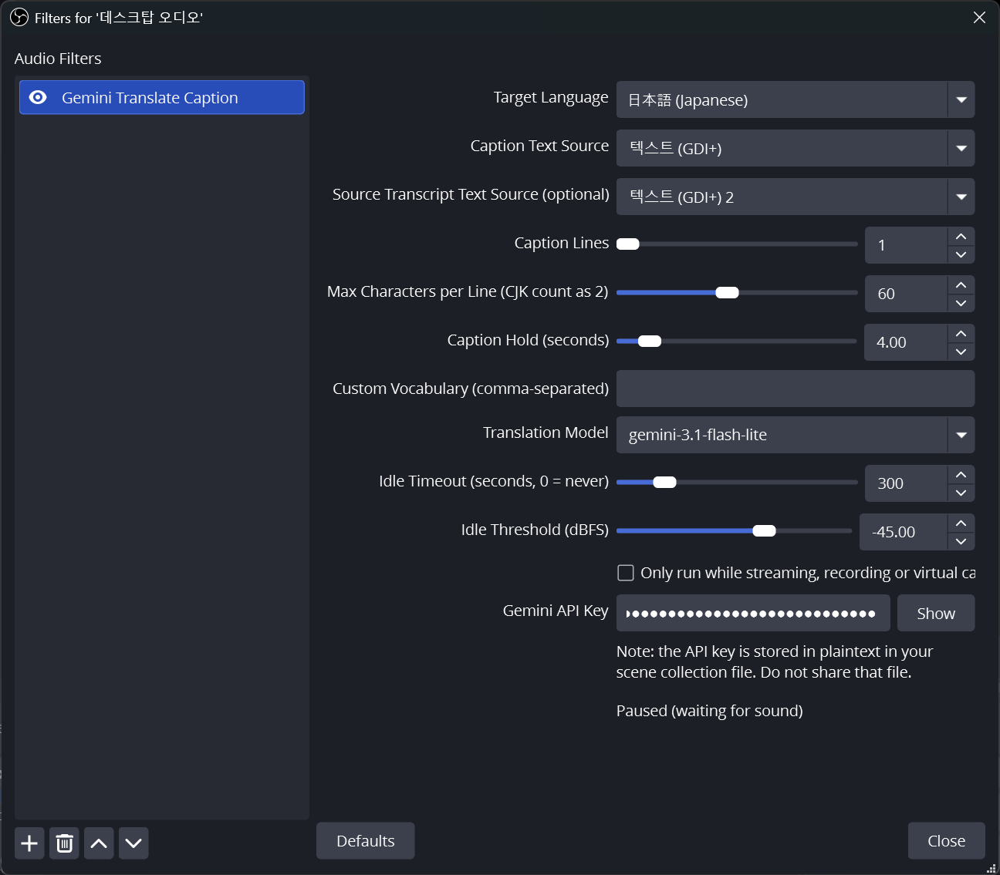

# Gemini Translate Caption for OBS

**English** | [한국어](README.ko.md)

[](https://github.com/plan12be/obs-live-translate-caption/releases)
[](https://github.com/plan12be/obs-live-translate-caption/actions/workflows/release.yaml)
[](LICENSE)


A native OBS Studio plugin (**Windows · macOS · Linux**) that turns a
microphone into live **translated captions** with Google **Gemini**: speech-to-
text with `gemini-3.5-transcribe-live`, per-sentence translation with a
Flash-Lite model (default `gemini-3.1-flash-lite`), written into an OBS text
source you style yourself — a subtitle overlay for streams and recordings.

This repository started as a fork of
[weisunglee/obs-live-translate](https://github.com/weisunglee/obs-live-translate)
(a speech-to-speech plugin) and is now a standalone, captions-only project;
the speech-to-speech output was removed (see
[`docs/specs/003-remove-speech-mode.md`](docs/specs/003-remove-speech-mode.md)).
The original project's history and GPLv2 license are kept.

> This plugin was built with significant assistance from AI (Claude). It is an
> independent project and is not affiliated with or endorsed by the OBS Project
> or Google.

## Getting a Gemini API key

The plugin needs a Google **Gemini API key**:

1. Sign in to **Google AI Studio** at <https://aistudio.google.com/apikey> with
   a Google account.
2. New users: AI Studio creates a default Google Cloud project and key
   automatically once you accept the Terms of Service. Otherwise click
   **Create API key**.
3. Copy the key and paste it into the **Gemini API Key** field of the *Gemini
   Translate Caption* filter.

Notes:

- The key is stored **in plaintext** in your scene-collection file — don't share
  that file.
- Usage is billed per Google's pricing for `gemini-3.5-transcribe-live` plus
  the selected translation model (default `gemini-3.1-flash-lite`). Check
  current quotas and pricing in AI Studio
  ([pricing](https://ai.google.dev/gemini-api/docs/pricing)).

## Status

Builds for **Windows, macOS and Linux**. Prebuilt packages are published on
this repository's
[Releases](https://github.com/plan12be/obs-live-translate-caption/releases) page
once a version tag is pushed; until then, build from source (see below). The
speech-only releases of the original project remain at
[weisunglee/obs-live-translate](https://github.com/weisunglee/obs-live-translate/releases).
Windows is the tested platform; see the note under *Install*. Current behavior:

- ✅ **Live captions**: speech-to-text with `gemini-3.5-transcribe-live`,
  segmented translation with a selectable Flash-Lite model, written into an
  OBS text source (plus an optional source-transcript text source). In-order
  display, SMART-revision replacement, per-segment failure isolation,
  hold-to-clear, automatic reconnect
  before the Live API's 10-minute session cap. See
  [`docs/specs/001-caption-translation-pipeline.md`](docs/specs/001-caption-translation-pipeline.md).
- ✅ **Segmented and paged captions**: stable parts of a long utterance can be
  translated before finalization. Results are wrapped to a configurable
  CJK-aware width and line count; each ordered page is appended to a rolling
  recent-lines window instead of dropping overflow with `…`. Segments from one
  finalized utterance share a line while they fit the configured width. See
  [`docs/specs/005-caption-segments-and-versioning.md`](docs/specs/005-caption-segments-and-versioning.md).
- ✅ **Custom vocabulary** biases recognition toward your proper nouns and is
  handed to the translator as a glossary; **Translation Model** is selectable.
- ✅ Reconnect with exponential backoff; live API-key / target-language changes.
- ✅ **Auto-pause**: the STT stream is closed after a configurable silence
  timeout (default 5 min) and optionally whenever no stream / recording /
  virtual camera is running, so an idle OBS does not keep billing audio; audio
  is buffered through the pause and the first words after it are kept. See
  [`docs/specs/004-idle-pause-and-output-gating.md`](docs/specs/004-idle-pause-and-output-gating.md).
- ✅ Single-session by design. If a source has two *Gemini Translate Caption*
  filters, only the first runs; the extra is disabled with a warning in its
  properties (removing the first lets the other take over). Note: the plugin
  runs a single STT stream, so adding the **filter to two different sources**
  is unsupported (both would feed the one session) — keep it on a single
  source.
- ⚠️ The 005 implementation and automated regression suite are complete; OBS
  and live API validation of incremental display, SMART revisions and timing is
  still pending.
- ❌ The speech-to-speech output of the original project (the *Gemini
  Translated Audio* source, echo and playback-delay options) was removed. This
  plugin uses its own filter id and name, so it does not conflict with the
  original one; filters made by the original plugin have to be re-added.

## Install (prebuilt)

Download the package for your platform from the
[Releases](https://github.com/plan12be/obs-live-translate-caption/releases) page
(or build it yourself, see *Build from source*), then install it **with OBS
closed**:

- **Windows** — run `…-windows-x64-installer.exe` (it detects your OBS install
  automatically), or extract `…-windows-x64.zip` into your OBS Studio directory
  (e.g. `C:\Program Files\obs-studio\`). Unsigned, so SmartScreen may warn.
- **macOS** — unzip `…-macos-universal.zip` and copy `obs-live-translate-caption.plugin`
  into `~/Library/Application Support/obs-studio/plugins/`. Unsigned / not
  notarized; if Gatekeeper blocks it, run
  `xattr -dr com.apple.quarantine ~/Library/Application\ Support/obs-studio/plugins/obs-live-translate-caption.plugin`.
- **Linux** — extract `…-linux-x86_64.tar.gz` into `~/.config/obs-studio/plugins/`
  (the `.so` should end up at
  `~/.config/obs-studio/plugins/obs-live-translate-caption/bin/64bit/obs-live-translate-caption.so`).

> The macOS and Linux packages are produced by CI but **not yet verified on those
> platforms** — feedback is welcome. Windows is the tested platform.

## Usage

1. Add a *Text (GDI+)* source (macOS / Linux: *Text (FreeType 2)*) to your
   scene and style it as you like — this is where the captions will appear.
   Optionally add a second one for the source-language transcript.

2. Add the **Gemini Translate Caption** filter to your microphone source
   (right-click the mic → *Filters* → **+** → *Gemini Translate Caption*). Paste
   your API key and pick a target language. The status reads *Paused (waiting
   for sound)* until you say something, then *Connected*.

   

3. In the filter pick your text source under **Caption Text Source**, and
   optionally the second one under **Source Transcript Text Source** to show
   what was recognized. **Caption Lines**
   (1–6, default 2) and **Max Characters per Line** (10–120, default 60; CJK
   characters count as 2) define the text box the plugin wraps into — the
   defaults fit a 1920×1080 scene at font size 48, i.e. about 30 Hangul or 60
   Latin characters per line. **Caption Hold (seconds)** (1–30) sets how long
   the latest displayed page or successful visible update stays; **Custom Vocabulary** takes comma-separated names or
   terms to bias recognition and is also handed to the translator as a
   glossary of proper names: they are rendered the way the target language
   writes foreign names (transliterated, or kept in Latin script where that
   is the convention) instead of being translated into common words.
   **Translation Model** picks the generateContent model (default
   `gemini-3.1-flash-lite`; the list is editable, so any model id your account
   can use works — an unknown id shows up as `translate failed: HTTP 404` in
   the log). Non-Lite models think longer by default, so expect more latency.
   **Translate while speaking** is on by default and translates stable parts of
   an utterance before finalization. SMART transcription can revise earlier
   words, so a visible caption may update. Turn it off to translate finalized
   text only while keeping segmentation, version checks and paging.
   On the text source itself leave *Word wrap* and
   *Use custom text extents* **off** (the plugin already wraps, and a second
   wrap would split lines twice) and set the horizontal alignment to center.
   Until a caption source is chosen the status reads *Set a caption text source
   to show captions*; a misspelled name shows *Caption text source "…" not
   found*. Choose different sources for translated captions and the source
   transcript. If both names are the same and non-empty, translated captions
   take priority and source-transcript output is disabled.

4. Auto-pause settings (all apply live, no reconnect):
   **Idle Timeout (seconds, 0 = never)** (0–1800, default 300) closes the STT
   stream after that much silence; the status then reads *Paused (idle)* and
   the next sound above the threshold reconnects. With a timeout set, a new
   session also starts as *Paused (waiting for sound)* and only connects once
   you speak, so an OBS left open costs nothing; set it to 0 to connect
   immediately and never pause. **Idle Threshold (dBFS)**
   (-90 to -20, default -45) is the level a 100 ms chunk must reach to count as
   sound. To pick it, watch the OBS audio mixer meter while you are quiet and
   set the threshold 5–10 dB above where it sits; if the meter idles above
   -45 (fans, laptop mics) raise the threshold or the filter never pauses.
   Putting an OBS **Noise Gate** filter *above* this one in the filter list
   makes silence exactly zero, so any threshold works. After changing it, talk
   at your normal volume and check the status stays *Connected*.
   **Only run while streaming, recording or virtual camera** keeps the
   session closed (*Paused (output inactive)*) until one of those outputs
   starts; leave it off to test captions before going live. A paused session
   still clears the caption after **Caption Hold**.

## Remote control (OBS WebSocket)

The filter's settings are plain OBS source settings, so you can change the
**target language**, caption box, vocabulary and model live from any OBS WebSocket v5 client
(scripts, [`obs-cli`](https://github.com/muesli/obs-cli), Advanced Scene
Switcher, your own app) using the `SetSourceFilterSettings` request — no extra
plugin support needed:

```json
{ "requestType": "SetSourceFilterSettings",
  "requestData": {
    "sourceName": "Mic/Aux",
    "filterName": "Gemini Translate Caption",
    "filterSettings": { "target_lang": "ja" } } }
```

| setting | type | meaning |
|---|---|---|
| `target_lang` | string | BCP-47 code from [`src/languages.hpp`](src/languages.hpp) (e.g. `en`, `zh`, `ja`, `pt-BR`) — the value, not the display name |
| `api_key` | string | Gemini API key (rarely sent remotely; clearing it stops the session) |
| `caption_text_source` | string | name of the text source that receives translated captions |
| `caption_source_text_source` | string | optional text source for the source-language transcript; empty disables it |
| `caption_incremental_translation` | bool | `true` (default) translates stable interim segments while speaking; `false` translates finalized text only while preserving segmentation, versioning and paging |
| `caption_max_lines` | int | lines kept on screen, clamped to 1-6 |
| `caption_max_chars_per_line` | int | line width in display units (CJK = 2), clamped to 10-120 |
| `caption_max_segments` | int | legacy (pre-002): read as the line count only when `caption_max_lines` has never been set |
| `caption_hold_seconds` | number | seconds after the latest displayed page or successful visible update before the caption source is cleared, clamped to 1-30 |
| `caption_custom_vocabulary` | string | comma-separated phrases passed to the transcriber as custom vocabulary and to the translator as a glossary of proper names (transliterated, never translated into common words) |
| `translate_model` | string | generateContent model id used for translation (default `gemini-3.1-flash-lite`); any id the account can access, e.g. `gemini-3.5-flash-lite`, `gemini-flash-lite-latest`; applies from the next sentence |
| `idle_timeout_seconds` | int | silence (below the threshold) before the STT stream is paused, clamped to 0-1800; `0` = never pause on silence. Setting it to `0` while paused resumes immediately |
| `idle_threshold_dbfs` | number | chunk RMS level that counts as sound, clamped to -90 to -20 (0 dBFS = full-scale 16-bit RMS) |
| `only_while_output_active` | bool | `true` keeps the session paused unless streaming, recording or the virtual camera is active |

Notes:

- `sourceName` / `filterName` must match your OBS names exactly (`filterName`
  defaults to *Gemini Translate Caption*; the name is deliberately not
  translated, so it is the same in a Korean-language OBS).
- Keep the request's default `overlay: true` (merge). With `overlay: false` OBS
  first resets the filter to defaults — and since `api_key` has no default, that
  **clears the key and stops translation**.
- Changing `target_lang` or the recognition vocabulary reconnects the STT session,
  so expect a brief gap. Changing `caption_incremental_translation` keeps the STT
  connection and visible provisional caption, but invalidates current provisional
  work that has not been displayed. The caption box, model and auto-pause settings
  apply live.
- If `caption_text_source` and `caption_source_text_source` are the same
  non-empty name, translated captions take priority and source-transcript output
  is disabled.
- Keys of the removed speech-to-speech mode (`output_mode`, `echo_target`,
  `playback_delay`) are ignored if a client still sends them.
- This is **set-only**. The runtime connection status (Connecting / Connected / Paused /
  API-key error) is not exposed over WebSocket — `GetSourceFilterSettings`
  returns the stored settings, not the live status.

## How it works

The plugin registers one OBS source: the **Gemini Translate Caption** *audio
filter*. Add it to your microphone source. It resamples the mic to 16 kHz mono
16-bit PCM, chunks it (100 ms / 3200-byte chunks) and streams it
**continuously** — silence included, which the model uses to detect the end of
an utterance — to `gemini-3.5-transcribe-live` (Live API speech-to-text, SMART
mode) over a TLS WebSocket. Stable segments can be translated while you speak;
final text is reconciled with them, and SMART corrections create newer segment
versions that replace only still-active captions. Translation uses the selected
Flash-Lite model (generateContent, the previous three segments as context) and
is written into an OBS **text source** you pick — so the subtitles
use whatever font, outline and position you set on that source. A second,
optional text source can show the source-language transcript live (interim
text while you speak, replaced by the final sentence).

Streaming silence still costs money, so the session **pauses itself**. A
fresh session does not connect at all until it hears something (*Paused
(waiting for sound)*), and once connected, a mic that stays below the idle
threshold for **Idle Timeout** (default 5 minutes) closes the WebSocket again
(*Paused (idle)*). The timeout also advances when the source stops delivering
audio entirely, and reconnects do not restart it. Audio keeps being buffered while paused; the first chunk
above the threshold connects (about 1–2 s), and the last second before it is
sent along, so the first words are not lost. To check that a key works, just
say a word and watch the status turn *Connected*. Optionally the filter can also run **only while
streaming, recording or the virtual camera is active** (*Paused (output
inactive)* otherwise). No translation request is made while paused or silent.
See
[`docs/specs/004-idle-pause-and-output-gating.md`](docs/specs/004-idle-pause-and-output-gating.md).

```
mic ─▶ [Gemini Translate Caption filter]
          resample 16 kHz mono → chunk → WebSocket ─▶ gemini-3.5-transcribe-live
                                                          │ interim / final text
                                                          ▼
       [Source Transcript text source] ◀── (optional) ◀──┤
                                                          │ stable / final segments
                                                          ▼
                                       generateContent ─▶ gemini-3.1-flash-lite
                                                          │ translation
                                                          ▼
       [Caption text source] ◀── CaptionPipeline (versioned, in-order pages)
```

Translations are appended in spoken segment order even when the model answers
out of order; a segment whose translation fails is skipped (logged) without
blocking the next one. Segment and utterance boundaries are joined with spaces;
explicit newlines in the text are preserved. The plugin wraps each segment itself
to **Max Characters per Line** display units (CJK characters count as 2, so
Korean/Japanese/Chinese lines hold half as many glyphs as Latin ones), shows
long results as consecutive pages of at most **Caption Lines**, keeps the most
recent translated lines as a rolling window, and clears that window after
**Caption Hold** measured from the latest displayed page or successful visible
update — so the text source's box never grows past what you sized it for.
When the visible interim's utterance is finalized, its hold restarts before source
reconciliation, including source corrections and segment merges. The current text
stays visible until its replacement arrives or the hold expires. If a correction
overlaps completed history ambiguously, the current text remains for its hold and
the next utterance can proceed. Captions that have already expired are not shown again.
The source transcript likewise keeps its *last* lines, so
the newest words stay visible while you speak. A single shared `CaptionSession`
owns the WebSocket (reconnect with backoff, proactive reconnect before the Live
API's 10-minute cap) and three translation workers.

## Build from source

Requires CMake ≥ 3.28 and a C++17 toolchain. Dependencies (nlohmann/json,
IXWebSocket + mbedTLS) are fetched by CMake; libobs/obs-deps come from
`buildspec.json` on Windows/macOS and from the system on Linux. The
`-DCMAKE_COMPILE_WARNING_AS_ERROR=OFF` flag keeps third-party warnings from
failing the build.

**Windows** (Visual Studio 2022) — produces `build_x64\RelWithDebInfo\obs-live-translate-caption.dll`:

```powershell
cmake --preset windows-x64 -DCMAKE_COMPILE_WARNING_AS_ERROR=OFF
cmake --build --preset windows-x64
```

With Visual Studio 2026 (CMake ≥ 4.1, e.g. the copy bundled with VS) use the
`windows-x64-vs2026` preset instead; it targets the newest installed Windows
SDK and shares the same `build_x64` output directory. On Windows the
Visual Studio generator is required — libobs' own CMake scripts reject Ninja
— so in CLion enable the preset-based profile rather than the default Ninja
"Debug" profile.

`cmake` is usually not on the PATH; the copy bundled with Visual Studio works
(the first configure also downloads obs-deps and builds libobs, which takes a
few minutes):

```powershell
$env:PATH = "C:\Program Files\Microsoft Visual Studio\18\Community\Common7\IDE\CommonExtensions\Microsoft\CMake\CMake\bin;$env:PATH"   # VS 2026
# VS 2022: C:\Program Files\Microsoft Visual Studio\2022\Community\Common7\IDE\CommonExtensions\Microsoft\CMake\CMake\bin
```

To try a local build, close OBS and copy the DLL (and the `.pdb`, so crashes
show function names in the OBS log) into the plugin directory:

```powershell
Copy-Item build_x64\RelWithDebInfo\obs-live-translate-caption.dll "C:\Program Files\obs-studio\obs-plugins\64bit\"
Copy-Item build_x64\RelWithDebInfo\obs-live-translate-caption.pdb "C:\Program Files\obs-studio\obs-plugins\64bit\"
Copy-Item -Recurse -Force data\locale "C:\Program Files\obs-studio\data\obs-plugins\obs-live-translate-caption\"
```

The third line installs the UI strings (`data/locale/en-US.ini`, `ko-KR.ini`);
without it the filter still works but shows the raw string keys as labels.
OBS picks the file matching its *Settings → General → Language*, falling back
to English.

**macOS** (Xcode 16+, universal) — produces `build_macos/RelWithDebInfo/obs-live-translate-caption.plugin`:

```bash
cmake --preset macos -DCMAKE_COMPILE_WARNING_AS_ERROR=OFF
cmake --build --preset macos --target obs-live-translate-caption
```

**Linux** — libobs comes from the obsproject PPA; install build deps first:

```bash
sudo add-apt-repository --yes ppa:obsproject/obs-studio
sudo apt-get update
sudo apt-get install -y obs-studio libsimde-dev libmbedtls-dev cmake ninja-build pkg-config
cmake --preset ubuntu-x86_64 -DCMAKE_COMPILE_WARNING_AS_ERROR=OFF
cmake --build --preset ubuntu-x86_64 --target obs-live-translate-caption   # build_x86_64/obs-live-translate-caption.so
```

(The exact CI steps live in [`.github/workflows/release.yaml`](.github/workflows/release.yaml).)

## Test

Use your platform's build directory (`build_x64` on Windows, `build_macos` on
macOS, `build_x86_64` on Linux). For example, on Windows:

```bash
# Build the libobs-free unit-test binary first
cmake --build --preset windows-x64 --target unit-tests

# Run the full unit-test suite
ctest --test-dir build_x64 --output-on-failure

# Run a single test case by name
ctest --test-dir build_x64 -R "<test case name>" --output-on-failure
```

The `unit-tests` target covers the pure logic (base64, ring buffer, backoff,
audio conversion, audio pacing/timestamper, Gemini protocol parsing, caption
protocol, translate request/response, caption composer, caption wrapping) and does **not**
require libobs. The caption modules also build as standalone binaries
(`caption-protocol`, `translate-protocol`, `caption-segmenter`,
`translation-scheduler`, `caption-composer`, `caption-pipeline`, `caption-wrap`; ctest names are
prefixed with `<module>/`) so one module can be iterated on without compiling
the rest.

## Project layout

```
src/
  plugin-main.cpp        module entry; registers the filter
  filter.cpp             mic filter: resample → chunk → feed the caption session
  caption-session.*      STT WebSocket + translate workers + text sinks + reconnect + auto-pause
  caption-pipeline.*     segment/version reducer, bounded scheduling and display effects
  caption-segmenter.*    stable interim/final segmentation and SMART revision reconciliation
  translation-scheduler.* bounded version-aware translation work queue
  pause-policy.*         idle detection (dBFS threshold + timeout) and pause reason (pure logic)
  output-state.*         streaming / recording / virtual-camera state via obs-frontend-api
  caption-protocol.*     build/parse gemini-3.5-transcribe-live messages + audio frames
  translate-protocol.*   Flash-Lite generateContent request/response
  caption-composer.*     in-order rolling page window, replacement + hold timer (pure logic)
  caption-wrap.*         display-width (CJK = 2) line wrapping (pure logic)
  caption-output.*       writes caption text into an OBS text source by name
  audio-convert.*        PCM downmix / conversion / chunking
  ring-buffer.*          bounded byte ring buffer
  backoff.*              exponential reconnect backoff
  base64.*, languages.hpp
tests/                   Catch2 unit tests (one per pure module)
data/locale/             UI strings (en-US, ko-KR); installed next to the plugin
installer/               Inno Setup script for the Windows installer
cmake/, CMakePresets.json, buildspec.json
```

## Tech stack

C++17 · CMake (obs-plugintemplate) · libobs (OBS 31.x) · IXWebSocket (TLS via
mbedTLS) · nlohmann/json · Catch2.

## Key API facts

- **Input** to Gemini: 16 kHz, 16-bit PCM, mono, little-endian, 100 ms chunks
  (`realtimeInput.audio`, `audio/pcm;rate=16000`, base64). The mic is streamed
  continuously, silence included, so the model can finalize on pauses. Only
  a long idle stretch (default 5 min below -45 dBFS) or no active OBS output
  closes the stream; audio input is billed per second, silence included, so
  this is where the auto-pause saves money.
- Speech-to-text: `models/gemini-3.5-transcribe-live` over the Live API
  WebSocket endpoint (`responseModalities: ["TEXT"]`, `inputAudioTranscription.mode:
  "SMART"`, `languageCodes: []` = auto-detect); interim text arrives as
  `serverContent.interimInputTranscription`, finalized sentences as
  `serverContent.inputTranscription`. Sessions are capped at 10 minutes, so the
  plugin reconnects proactively at 9. The batch model `gemini-3.5-transcribe`
  is file/Interactions-API only and cannot be used for live captions.
- Translation uses
  `POST …/v1beta/models/gemini-3.1-flash-lite:generateContent` with the
  `x-goog-api-key` header, a single `role: "user"` turn and no sampling
  parameters. No `thinkingConfig` is sent (Flash-Lite already defaults to
  minimal thinking); if it is ever added, the REST shape is the camelCase
  `generationConfig.thinkingConfig.thinkingLevel` — the SDK-style flat
  `thinking_level` is rejected with HTTP 400 "Unknown name".

## Supported languages

The **target language** dropdown lists the languages in
[`src/languages.hpp`](src/languages.hpp), each labelled with its native name
plus the English name (e.g. `日本語 (Japanese)`) so both native speakers and
others can recognize it. Common languages — English, Chinese, Japanese, Korean,
Spanish, French, German, Portuguese (BR), Italian, Russian, Indonesian, Thai,
Vietnamese — are pinned to the top; the rest follow in English-name
alphabetical order. The translation prompt names the language in English plus
its BCP-47 code, so any language the translation model handles works; the list
is inherited from the original project and can be extended in that file.

Chinese uses the script-less code **`zh`**; the translator writes Simplified
Chinese by default. Ask for `zh-Hant` in the list if you need Traditional.

There is **no source-language selection** — the transcriber auto-detects the
spoken language (including mid-sentence switches), so you only pick what to
translate *into*.

## Non-goals

Multiple simultaneous sessions (two target languages at once), speech-to-speech
output, encrypted key storage, and explicit source-language selection are out
of scope. The plugin only updates an existing OBS text source: it does not
create or style sources, write caption files (SRT/TXT), or embed CEA-608
captions into the stream output — see the non-goals tables in
[`docs/specs/001-caption-translation-pipeline.md`](docs/specs/001-caption-translation-pipeline.md)
and [`docs/specs/003-remove-speech-mode.md`](docs/specs/003-remove-speech-mode.md).

## License

Licensed under the GNU General Public License v2.0 — see [LICENSE](LICENSE).
This matches OBS Studio's licensing, since the plugin links against libobs.

Copyright (C) 2026 plan12be. Based on
[obs-live-translate](https://github.com/weisunglee/obs-live-translate),
Copyright (C) 2026 Only26k (weisunglee), also GPL-2.0. The build system,
installer, audio capture/chunking and the original speech-to-speech pipeline
originate from that project; the captions pipeline was added here and the
speech-to-speech output was later removed.
